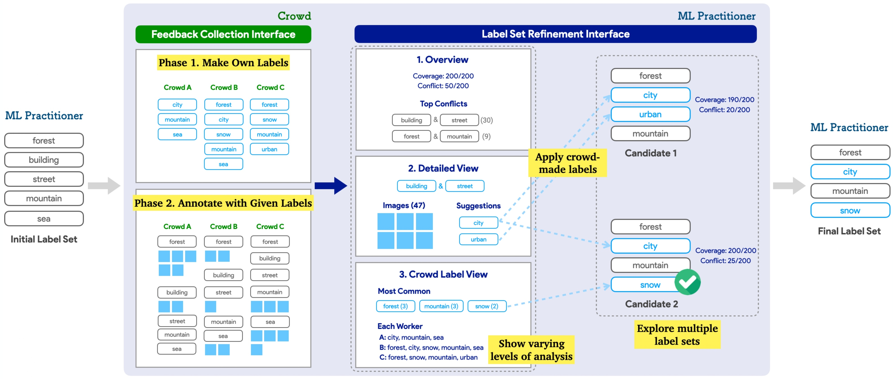
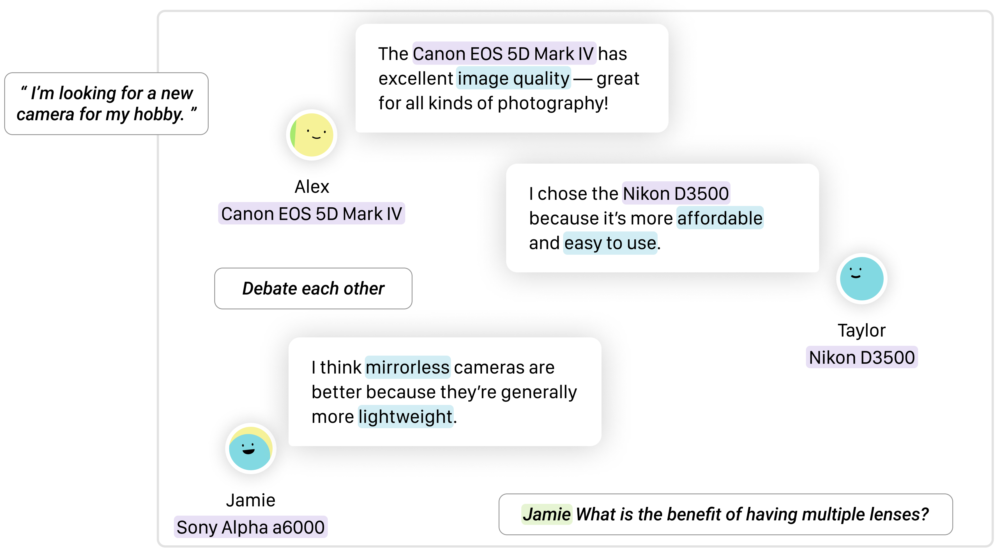
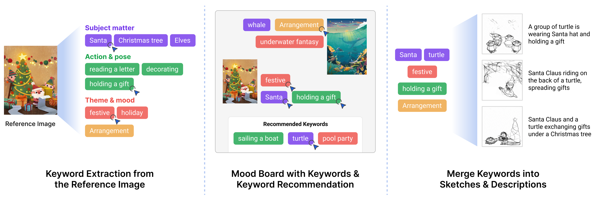
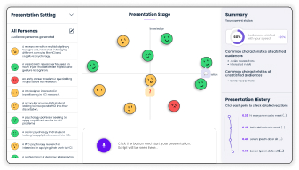

<h2>Conference Papers</h2>

    

            
    

    

        <a id="blue-bg" class="pub-title" href="">DynamicLabels: Supporting Informed Construction of Machine Learning Label Sets with Crowd Feedback</a>  
        <b class="pub-me">Jeongeon Park</b>, <a class="collaborator" href="https://eunyoungko.com/">Eun-Young Ko</a>, Yeon Su Park, <a class="collaborator" href="https://scholar.google.co.kr/citations?hl=en&user=UltFXK0AAAAJ">Jinyeong Yim</a>, <a class="collaborator" href="https://juhokim.com/">Juho Kim</a>  
         IUI 2024 (to appear) 
    

    

            
    

    

        <a id="blue-bg" class="pub-title" href="https://dl.acm.org/doi/10.1145/3432924">ProtoChat: Supporting the Conversation Design Process with Crowd Feedback</a>  
        <a class="collaborator" href="https://www.yoonseochoi.com/">Yoonseo Choi</a>, <a class="collaborator" href="https://www.linkedin.com/in/tjmonsi/">Toni-Jan Keith Monserrat</a>, <b class="pub-me">Jeongeon Park</b>, <a class="collaborator" href="https://hyungyu.com/">Hyungyu Shin</a>, <a class="collaborator" href="https://scholar.google.com/citations?user=nXhihPQAAAAJ">Nyoungwoo Lee</a>, <a class="collaborator" href="https://juhokim.com/">Juho Kim</a>  
         CSCW 2020 | <a id="plain-bg" href="http://protochat.kixlab.org/">Project Website</a> | <a id="plain-bg" href="https://www.youtube.com/watch?v=oIBt3EkH-eE">Presentation Video</a> 
    

<h2>Preprints</h2>

    

        
    

    

        <a id="blue-bg" class="pub-title" href="https://arxiv.org/abs/2310.01331">ChoiceMates: Supporting Unfamiliar Online Decision-Making with Multi-Agent Conversational Interactions</a>  
        <b class="pub-me">Jeongeon Park</b>, <a class="collaborator" href="https://bryanmin.me/">Bryan Min</a>, <a class="collaborator" href="https://www.cse.ust.hk/~mxj/">Xiaojuan Ma</a>, <a class="collaborator" href="https://juhokim.com/">Juho Kim</a>  
        arXiv 2023 (October 2023) 
    

    

        
    

    

        <a id="blue-bg" class="pub-title" href="https://arxiv.org/abs/2312.11949">CreativeConnect: Supporting Reference Recombination for Graphic Design Ideation with Generative AI</a>  
        <a class="collaborator" href="https://daeunchoi.com/">DaEun Choi</a>, Sumin Hong, <b class="pub-me">Jeongeon Park</b>, <a class="collaborator" href="https://johnr0.github.io/">John Joon Young Chung</a>, <a class="collaborator" href="https://juhokim.com/">Juho Kim</a>  
          arXiv 2023 (December 2023) 
    

<h2>Posters, Demos, Workshop Papers</h2>

    

        
    

    

        <a id="blue-bg" class="pub-title" href="https://dl.acm.org/doi/10.1145/3586182.3625114">AudiLens: Configurable LLM-Generated Audiences for Public Speech Practice</a>  
        <b class="pub-me">Jeongeon Park</b>*, <a class="collaborator" href="https://daeunchoi.com/">DaEun Choi</a>* (* equal contribution)  
        UIST 2023 Student Innovation Contest | <b style="color:orange;margin:5px 0 0;">Jury's Best SIC Honorable Mention </b>
    

    

        <a id="blue-bg" class="pub-title" href="/assets/pdf/hcikorea2022-rebalance-capstone.pdf">reBalance: A Customizable Data Visualization Approach to Keeping a Balanced Health</a>  
        Sangkyung Kwak, <a class="collaborator" href="https://wulanfrom-design.netlify.app/">Nabila Sindi Listyo</a>, <b class="pub-me">Jeongeon Park</b>, <a class="collaborator" href="https://scholar.google.co.kr/citations?user=Sc2pBzYAAAAJ">Uichin Lee</a>  
         HCI Korea 2022 Capstone Paper 
    

    

        <a id="blue-bg" class="pub-title" href="https://www.humancomputation.com/assets/wips_demos/HCOMP_2021_paper_97.pdf">Supporting Dynamic Construction of Datasets with Annotator Suggestions</a>  
        <b class="pub-me">Jeongeon Park</b>, <a class="collaborator" href="https://eunyoungko.com/">Eun-Young Ko</a>, <a class="collaborator" href="https://scholar.google.com/citations?user=aVnLn_IAAAAJ&hl=en">Donghoon Han</a>, <a class="collaborator" href="https://scholar.google.co.kr/citations?hl=en&user=UltFXK0AAAAJ">Jinyeong Yim</a>, <a class="collaborator" href="https://juhokim.com/">Juho Kim</a>  
         HCOMP 2021 Works-in-Progress | <a id="plain-bg" href="https://slideslive.com/38969666">Presentation Video</a> 
    

    

        <a id="blue-bg" class="pub-title" href="https://dl.acm.org/doi/10.1145/3406865.3418568">ProtoChat: Supporting the Conversation Design Process with Crowd Feedback</a>  
        <a class="collaborator" href="https://www.yoonseochoi.com/">Yoonseo Choi</a>, <a class="collaborator" href="https://www.linkedin.com/in/tjmonsi/">Toni-Jan Keith Monserrat</a>, <b class="pub-me">Jeongeon Park</b>, <a class="collaborator" href="https://hyungyu.com/">Hyungyu Shin</a>, <a class="collaborator" href="https://scholar.google.com/citations?user=nXhihPQAAAAJ">Nyoungwoo Lee</a>, <a class="collaborator" href="https://juhokim.com/">Juho Kim</a>  
         CSCW 2020 Demo 
    

    

        <a id="blue-bg" class="pub-title" href="https://dl.acm.org/doi/10.1145/3405755.3406155">Leveraging the Crowd to Support the Conversation Design Process</a>  
        <a class="collaborator" href="https://www.yoonseochoi.com/">Yoonseo Choi</a>, <a class="collaborator" href="https://hyungyu.com/">Hyungyu Shin</a>, <a class="collaborator" href="https://www.linkedin.com/in/tjmonsi/">Toni-Jan Keith Monserrat</a>, <a class="collaborator" href="https://scholar.google.com/citations?user=nXhihPQAAAAJ">Nyoungwoo Lee</a>, <b class="pub-me">Jeongeon Park</b>, <a class="collaborator" href="https://juhokim.com/">Juho Kim</a>  
         CHI 2020 Workshop on CUI@CHI: Mapping Grand Challenges for the Conversational User Interface Community 
    

    

        <a id="blue-bg" class="pub-title" href="https://arxiv.org/abs/2310.01331">Supporting an Iterative Conversation Design Process</a>  
        <a class="collaborator" href="https://www.yoonseochoi.com/">Yoonseo Choi</a>, <a class="collaborator" href="https://hyungyu.com/">Hyungyu Shin</a>, <a class="collaborator" href="https://www.linkedin.com/in/tjmonsi/">Toni-Jan Keith Monserrat</a>, <a class="collaborator" href="https://scholar.google.com/citations?user=nXhihPQAAAAJ">Nyoungwoo Lee</a>, <b class="pub-me">Jeongeon Park</b>, <a class="collaborator" href="https://juhokim.com/">Juho Kim</a>  
         CHI 2020 Extended Abstracts 
    

