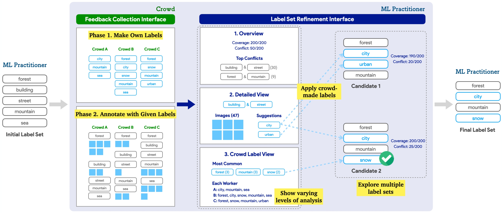
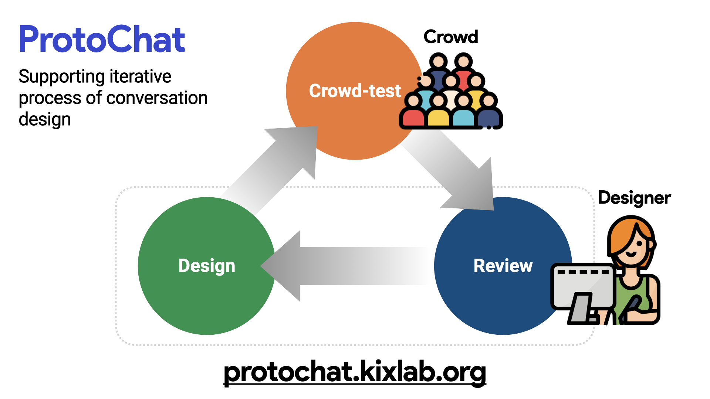
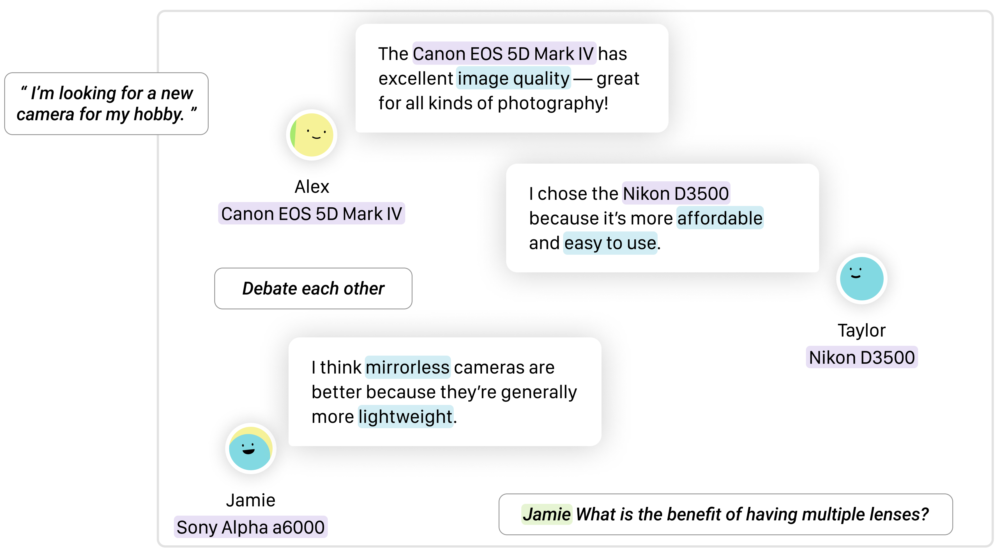
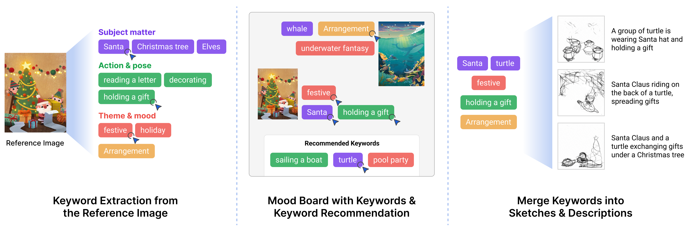

<h2>Conference Papers</h2>

    

            
    

    

        <a id="focus" class="pub-title" href="">DynamicLabels: Supporting Informed Construction of Machine Learning Label Sets with Crowd Feedback</a>  
        <b class="pub-me">Jeongeon Park</b>, Eun-Young Ko, Yeon Su Park, Jinyeong Yim, Juho Kim  
        <b style="color:grey;margin:5px 0 0;"> IUI 2024 (to appear) </b>
    

    

            
    

    

        <a id="focus" class="pub-title" href="https://dl.acm.org/doi/10.1145/3432924">ProtoChat: Supporting the Conversation Design Process with Crowd Feedback</a>  
        Yoonseo Choi, Toni-Jan Keith Monserrat, <b class="pub-me">Jeongeon Park</b>, Hyungyu Shin, Nyoungwoo Lee, Juho Kim  
        <b style="color:grey;margin:5px 0 0;"> CSCW 2020 | <a id="special" href="http://protochat.kixlab.org/">Project Website</a> | <a id="special" href="https://www.youtube.com/watch?v=oIBt3EkH-eE">Presentation Video</a> </b>
    

<h2>Preprints</h2>

    

        
    

    

        <a id="focus" class="pub-title" href="https://arxiv.org/abs/2310.01331">ChoiceMates: Supporting Unfamiliar Online Decision-Making with Multi-Agent Conversational Interactions</a>  
        <b class="pub-me">Jeongeon Park</b>, Bryan Min, Xiaojuan Ma, Juho Kim  
        <b style="color:grey;margin:5px 0 0;">  arXiv 2023 (October 2023) </b>
    

    

        
    

    

        <a id="focus" class="pub-title" href="https://arxiv.org/abs/2312.11949">CreativeConnect: Supporting Reference Recombination for Graphic Design Ideation with Generative AI</a>  
        DaEun Choi, Sumin Hong, <b class="pub-me">Jeongeon Park</b>, John Joon Young Chung, Juho Kim  
        <b style="color:grey;margin:5px 0 0;">  arXiv 2023 (December 2023) </b>
    

<h2>Posters, Demos, Workshop Papers</h2>

    

        
    

    

        <a id="focus" class="pub-title" href="https://dl.acm.org/doi/10.1145/3586182.3625114">AudiLens: Configurable LLM-Generated Audiences for Public Speech Practice</a>  
        <b class="pub-me">Jeongeon Park*</b>, DaEun Choi* (* equal contribution)  
        <b style="color:grey;margin:5px 0 0;">UIST 2023 Student Innovation Contest |</b> <b style="color:orange;margin:5px 0 0;">Jury's Best SIC Honorable Mention </b>
    

    

        <a id="focus" class="pub-title" href="/assets/pdf/hcikorea2022-rebalance-capstone.pdf">reBalance: A Customizable Data Visualization Approach to Keeping a Balanced Health</a>  
        Sangkyung Kwak, Nabila Sindi Listyo, <b class="pub-me">Jeongeon Park</b>, Uichin Lee  
        <b style="color:grey;margin:5px 0 0;"> HCI Korea 2022 Capstone Paper </b>
    

    

        <a id="focus" class="pub-title" href="https://www.humancomputation.com/assets/wips_demos/HCOMP_2021_paper_97.pdf">Supporting Dynamic Construction of Datasets with Annotator Suggestions</a>  
        <b class="pub-me">Jeongeon Park</b>,  Eun-Young Ko, Donghoon Han, Jinyeong Yim, Juho Kim  
        <b style="color:grey;margin:5px 0 0;"> HCOMP 2021 Works-in-Progress | <a id="special" href="https://slideslive.com/38969666">Presentation Video</a> </b>
    

    

        <a id="focus" class="pub-title" href="https://dl.acm.org/doi/10.1145/3406865.3418568">ProtoChat: Supporting the Conversation Design Process with Crowd Feedback</a>  
        Yoonseo Choi, Toni-Jan Keith Monserrat, <b class="pub-me">Jeongeon Park</b>, Hyungyu Shin, Nyoungwoo Lee, Juho Kim  
        <b style="color:grey;margin:5px 0 0;"> CSCW 2020 Demo </b>
    

    

        <a id="focus" class="pub-title" href="https://dl.acm.org/doi/10.1145/3405755.3406155">Leveraging the Crowd to Support the Conversation Design Process</a>  
        Yoonseo Choi, Hyungyu Shin, Toni-Jan Keith Monserrat, Nyoungwoo Lee, <b class="pub-me">Jeongeon Park</b>, Juho Kim  
        <b style="color:grey;margin:5px 0 0;"> CHI 2020 Workshop on CUI@CHI: Mapping Grand Challenges for the Conversational User Interface Community </b>
    

    

        <a id="focus" class="pub-title" href="https://arxiv.org/abs/2310.01331">Supporting an Iterative Conversation Design Process</a>  
        Yoonseo Choi, Hyungyu Shin, Toni-Jan Keith Monserrat, Nyoungwoo Lee, <b class="pub-me">Jeongeon Park</b>, Juho Kim  
        <b style="color:grey;margin:5px 0 0;"> CHI 2020 Extended Abstracts </b>
    

