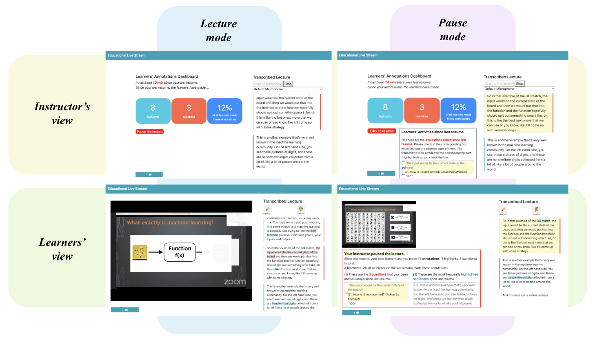

<h2>Conference Papers</h2>

    

        
    

    

        <a id="blue-bg" class="pub-title" href="" >EduLive: Re-Creating Cues for Instructor-Learner Interaction in Educational Live Streams with Learners' Transcript-Based Annotations</a>  
        <a class="collaborator" href="https://jc-fang.github.io/" >Jingchao Fang</a>, <b class="pub-me">Jeongeon Park</b>, <a class="collaborator" href="https://juhokim.com/" >Juho Kim</a>, <a class="collaborator" href="http://www.haochuanwang.info/" >Hao-Chuan Wang</a>  
          CSCW 2024 (to appear) 
    

    

        
    

    

        <a id="blue-bg" class="pub-title" href="./assets/pdf/papers/chi24-creativeconnect.pdf" >CreativeConnect: Supporting Reference Recombination for Graphic Design Ideation with Generative AI</a>  
        <a class="collaborator" href="https://daeunchoi.com/" >DaEun Choi</a>, Sumin Hong, <b class="pub-me">Jeongeon Park</b>, <a class="collaborator" href="https://johnr0.github.io/" >John Joon Young Chung</a>, <a class="collaborator" href="https://juhokim.com/" >Juho Kim</a>  
          CHI 2024 (to appear)  | <a id="plain-bg" href="https://arxiv.org/abs/2312.11949" >arXiv</a> | <a id="plain-bg" href="http://creativeconnect.kixlab.org/" >Project Website</a> 
    

    

            
    

    

        <a id="blue-bg" class="pub-title" href="./assets/pdf/papers/iui24-dynamiclabels.pdf" >DynamicLabels: Supporting Informed Construction of Machine Learning Label Sets with Crowd Feedback</a>  
        <b class="pub-me">Jeongeon Park</b>, <a class="collaborator" href="https://eunyoungko.com/" >Eun-Young Ko</a>, Yeon Su Park, <a class="collaborator" href="https://scholar.google.co.kr/citations?hl=en&user=UltFXK0AAAAJ" >Jinyeong Yim</a>, <a class="collaborator" href="https://juhokim.com/" >Juho Kim</a>  
         IUI 2024  | <a id="plain-bg" href="https://dl.acm.org/doi/10.1145/3640543.3645157" >ACM DL</a> | <a id="plain-bg" href="http://dynamiclabels.kixlab.org/" >Project Website</a> 
    

    

            
    

    

        <a id="blue-bg" class="pub-title" href="./assets/pdf/papers/cscw20-protochat.pdf" >ProtoChat: Supporting the Conversation Design Process with Crowd Feedback</a>  
        <a class="collaborator" href="https://www.yoonseochoi.com/" >Yoonseo Choi</a>, <a class="collaborator" href="https://www.linkedin.com/in/tjmonsi/" >Toni-Jan Keith Monserrat</a>, <b class="pub-me">Jeongeon Park</b>, <a class="collaborator" href="https://hyungyu.com/" >Hyungyu Shin</a>, <a class="collaborator" href="https://scholar.google.com/citations?user=nXhihPQAAAAJ" >Nyoungwoo Lee</a>, <a class="collaborator" href="https://juhokim.com/" >Juho Kim</a>  
         CSCW 2020 | <a id="plain-bg" href="https://dl.acm.org/doi/10.1145/3432924" >ACM DL</a> | <a id="plain-bg" href="http://protochat.kixlab.org/" >Project Website</a> | <a id="plain-bg" href="https://www.youtube.com/watch?v=oIBt3EkH-eE" >Presentation Video</a> 
    

<!-- <h2>Preprints</h2>

    

        
    

    

        <a id="blue-bg" class="pub-title" href="https://arxiv.org/abs/2310.01331">ChoiceMates: Supporting Unfamiliar Online Decision-Making with Multi-Agent Conversational Interactions</a>  
        <b class="pub-me">Jeongeon Park</b>, <a class="collaborator" href="https://bryanmin.me/">Bryan Min</a>, <a class="collaborator" href="https://www.cse.ust.hk/~mxj/">Xiaojuan Ma</a>, <a class="collaborator" href="https://juhokim.com/">Juho Kim</a>  
        arXiv 2023 (October 2023) 
    

 -->

<h2>Posters, Demos, Workshop Papers</h2>

    

        <a id="blue-bg" class="pub-title" href="./assets/pdf/posters/chi24-sensemaking-choicmates.pdf" >How do multiple LLM-powered conversational agents assist sensemaking and decision-making in an unfamiliar domain?</a>  
        <b class="pub-me">Jeongeon Park</b>, <a class="collaborator" href="https://bryanmin.me/">Bryan Min</a>, <a class="collaborator" href="https://jyskwon.github.io/">Jean Y. Song</a>, <a class="collaborator" href="https://www.cse.ust.hk/~mxj/">Xiaojuan Ma</a>, <a class="collaborator" href="https://juhokim.com/">Juho Kim</a>  
         CHI 2024 Sensemaking Workshop 
    

    

        
    

    

        <a id="blue-bg" class="pub-title" href="https://dl.acm.org/doi/10.1145/3586182.3625114" >AudiLens: Configurable LLM-Generated Audiences for Public Speech Practice</a>  
        <b class="pub-me">Jeongeon Park</b>*, <a class="collaborator" href="https://daeunchoi.com/" >DaEun Choi</a>* (* equal contribution)  
        UIST 2023 Student Innovation Contest | <b style="color:orange;margin:5px 0 0;">Jury's Best SIC Honorable Mention </b>
    

    

        <a id="blue-bg" class="pub-title" href="./assets/pdf/posters/hcikorea22-rebalance-capstone.pdf" >reBalance: A Customizable Data Visualization Approach to Keeping a Balanced Health</a>  
        Sangkyung Kwak, <a class="collaborator" href="https://wulanfrom-design.netlify.app/" >Nabila Sindi Listyo</a>, <b class="pub-me">Jeongeon Park</b>, <a class="collaborator" href="https://scholar.google.co.kr/citations?user=Sc2pBzYAAAAJ" >Uichin Lee</a>  
         HCI Korea 2022 Capstone Paper 
    

    

        <!-- <a id="blue-bg" class="pub-title" href="https://www.humancomputation.com/assets/wips_demos/HCOMP_2021_paper_97.pdf">Supporting Dynamic Construction of Datasets with Annotator Suggestions</a>   -->
        <a id="blue-bg" class="pub-title" href="https://kixlab.github.io/website-files/2021/hcomp2021-wip-dynamiclabels-paper.pdf">Supporting Dynamic Construction of Datasets with Annotator Suggestions</a>  
        <b class="pub-me">Jeongeon Park</b>, <a class="collaborator" href="https://eunyoungko.com/">Eun-Young Ko</a>, <a class="collaborator" href="https://scholar.google.com/citations?user=aVnLn_IAAAAJ&hl=en">Donghoon Han</a>, <a class="collaborator" href="https://scholar.google.co.kr/citations?hl=en&user=UltFXK0AAAAJ">Jinyeong Yim</a>, <a class="collaborator" href="https://juhokim.com/">Juho Kim</a>  
         HCOMP 2021 Works-in-Progress  | <a id="plain-bg" href="https://slideslive.com/38969666">Presentation Video</a> 
    

    

        <a id="blue-bg" class="pub-title" href="https://dl.acm.org/doi/10.1145/3406865.3418568">ProtoChat: Supporting the Conversation Design Process with Crowd Feedback</a>  
        <a class="collaborator" href="https://www.yoonseochoi.com/">Yoonseo Choi</a>, <a class="collaborator" href="https://www.linkedin.com/in/tjmonsi/">Toni-Jan Keith Monserrat</a>, <b class="pub-me">Jeongeon Park</b>, <a class="collaborator" href="https://hyungyu.com/">Hyungyu Shin</a>, <a class="collaborator" href="https://scholar.google.com/citations?user=nXhihPQAAAAJ">Nyoungwoo Lee</a>, <a class="collaborator" href="https://juhokim.com/">Juho Kim</a>  
         CSCW 2020 Demo 
    

    

        <a id="blue-bg" class="pub-title" href="https://dl.acm.org/doi/10.1145/3405755.3406155">Leveraging the Crowd to Support the Conversation Design Process</a>  
        <a class="collaborator" href="https://www.yoonseochoi.com/">Yoonseo Choi</a>, <a class="collaborator" href="https://hyungyu.com/">Hyungyu Shin</a>, <a class="collaborator" href="https://www.linkedin.com/in/tjmonsi/">Toni-Jan Keith Monserrat</a>, <a class="collaborator" href="https://scholar.google.com/citations?user=nXhihPQAAAAJ">Nyoungwoo Lee</a>, <b class="pub-me">Jeongeon Park</b>, <a class="collaborator" href="https://juhokim.com/">Juho Kim</a>  
         CHI 2020 Workshop on CUI@CHI: Mapping Grand Challenges for the Conversational User Interface Community 
    

    

        <a id="blue-bg" class="pub-title" href="https://dl.acm.org/doi/abs/10.1145/3334480.3382951">Supporting an Iterative Conversation Design Process</a>  
        <a class="collaborator" href="https://www.yoonseochoi.com/">Yoonseo Choi</a>, <a class="collaborator" href="https://hyungyu.com/">Hyungyu Shin</a>, <a class="collaborator" href="https://www.linkedin.com/in/tjmonsi/">Toni-Jan Keith Monserrat</a>, <a class="collaborator" href="https://scholar.google.com/citations?user=nXhihPQAAAAJ">Nyoungwoo Lee</a>, <b class="pub-me">Jeongeon Park</b>, <a class="collaborator" href="https://juhokim.com/">Juho Kim</a>  
         CHI 2020 Extended Abstracts 
    

